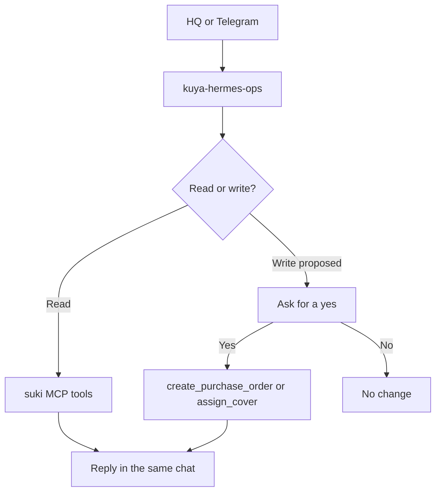

# Product Requirements Document (PRD)

**Project:** Kuya Hermes
**Date:** 2026-10-02
**Version:** 0.1
**Owner:** Kuya Hermes team
**Status:** Locked
**Last reconciled:** 2026-10-02
**BRD:** N/A. No BRD. Rapid Production, no revenue model.
**IDEA:** [idea-kuya-hermes.md](idea-kuya-hermes.md)
**SCRUTINY:** [scrutiny-kuya-hermes.md](scrutiny-kuya-hermes.md)

---

## 1. Product Purpose & Value Proposition

Kuya Hermes is the branch-ops copilot for Suki Mart, a fictional 12-branch grocery chain in Metro Manila. One Hermes agent serves the HQ ops lead in Hermes Desktop and a branch manager on Telegram. Both surfaces use the `kuya-hermes-ops` skill and the `suki` MCP server over `data/store.db`.

The product connects stock, purchase orders, supplier lead times, shifts, and unanswered tickets in one loop: detect, check, propose, confirm, act. Nothing that writes is filed until a person says yes.

---

## 2. Target Personas

**Primary Persona; HQ ops lead**
- *Who they are:* The person responsible for all 12 branches, working in Hermes Desktop on the team laptop.
- *Their core frustration:* Ermita can be at 14 stockouts with no purchase order while BGC has four open orders for the same juice, and those facts live in different tables.
- *What success looks like for them:* One sweep ranks the network, the worst branch is obvious, and a yes returns PO numbers.

**Secondary Persona; Branch manager on the floor**
- *Who they are:* A manager who can spare one sentence, often in Taglish.
- *Their core frustration:* "di pumasok si John Soriano bukas ng 7am sa Alabang" should become a covered shift, not a hunt through the roster.

---

## 3. Core Features & Priorities

| ID | Feature | Description | Priority |
|----|---------|-------------|----------|
| PRD-F1 | Domain MCP tools | Seven tools in `mcp-server/server.py`: `network_sweep`, `branch_pulse`, `check_restock`, `create_purchase_order`, `find_staff_shifts`, `find_shift_cover`, `assign_cover`. SQL stays inside the tools. Starter helpers `describe_sandbox` and `list_branches` stay, and they are not part of the seven. | Must-Have |
| PRD-F2 | Ops skill | `kuya-hermes-ops` chains the tools for sweep, pulse, stockouts, and shift cover. It reads Taglish and English. It asks before every write. | Must-Have |
| PRD-F3 | HQ desktop plugin | `kuya-hermes-hq` sidebar page: Run full sweep, 12 branch cards, branch pulse, fix stockouts, cover shift gaps, Ask Kuya, side pane, Ctrl+K. | Must-Have |
| PRD-F4 | Confirm before write | `create_purchase_order` refuses an open duplicate. `assign_cover` books only after a yes. The skill states what will change, including "I-file ko na ba?" | Must-Have |
| PRD-F5 | Telegram field channel | The Hermes Telegram gateway uses the same skill and MCP server. Replies stay short. Tool progress stays off in that channel. | Must-Have |
| PRD-F6 | Read-only web snapshot | Landing page and dashboard from the same read functions. Vercel build is a static snapshot. Live chat on the laptop proxies Hermes and does not write by itself. | Should-Have |
| PRD-F7 | Generic SQL and the sari-sari prototype | No `run_sql` tool. `sari-sari/` is an earlier single-store prototype and is not this submission. | Won't-Have (v1) |

---

## 4. User Stories & Acceptance Criteria

**PRD-F1.** As the HQ ops lead, I want domain tools instead of raw SQL so that Hermes answers branch questions without inventing rows.

- Given the sandbox date 2026-09-30, when `network_sweep` runs, then every branch comes back with a risk score and Ermita is among the worst on out-of-stock items with no PO.
- Given an unknown branch code, when a tool resolves it, then the caller gets the valid codes and no write occurs.

**PRD-F2.** As a branch manager, I want a short Taglish report to start the right workflow so that I do not have to name a tool.

- Given "ubos na ang bottled water sa ALB", when the skill runs, then it resolves ALB and calls `check_restock` before any PO.
- Given a Desktop sweep request, when the skill finishes step 1, then the reply lists the worst branches before it drafts writes.

**PRD-F3.** As the HQ ops lead, I want one sidebar page so that I can run the sweep without typing the procedure.

- Given the plugin is reloaded, when I press Run full sweep, then the composer submits a prompt that names `kuya-hermes-ops`.
- Given a tool result arrives, when the plugin renders it, then the numbers on the page come from that result.

**PRD-F4.** As the HQ ops lead, I want a yes gate so that a mistaken prompt cannot file a duplicate PO or change a shift.

- Given an open PO for that SKU at that branch, when `create_purchase_order` is called, then `created` is false and the open PO is returned.
- Given the user has not confirmed, when the skill is followed, then neither write tool is called.

**PRD-F5.** As a branch manager, I want the same answers on Telegram so that the floor and HQ do not diverge.

- Given John Soriano's 07:00 Alabang shift on 2026-10-01, when the absence message is handled and the user says yes, then `assign_cover` can book Rowena Tomas.
- Given a Telegram session, when a tool runs, then the manager sees the final answer, not a tool-progress stream.

**PRD-F6.** As a judge whose live chat died, I want the public dashboard so that the sandbox numbers are still visible.

- Given `web/build_static.py` has been deployed, when I open `/dashboard`, then the page shows pre-rendered JSON and does not call the laptop.

---

## 5. App Flow & UX Intent

### 5.1 Screen Inventory

| Screen | Purpose | Entry points | States to design |
|--------|---------|--------------|------------------|
| Kuya Hermes HQ | Network sweep, branch cards, actions, Ask Kuya | Hermes Desktop sidebar, route `/kuya-hermes` | loading (sweep running), success (badges filled), error (gateway down), empty (no sweep yet) |
| Side pane | Compact actions next to chat | Plugin pane | same four states, narrower layout |
| Landing `/` | Problem and product story | https://kuya-hermes.vercel.app and `http://localhost:8787` | success with stats, error if API missing on the local server |
| Dashboard `/dashboard` | KPIs, branch risk, pulse, optional live chat | Nav from landing | loading, success, chat error when Hermes is down |
| Telegram chat | Field reports | https://t.me/kuyahermes_bot | bot online, bot silent when the laptop gateway is off |

### 5.2 Navigation Model & Information Architecture

**Primary navigation pattern:** Hermes Desktop sidebar for HQ. A single Telegram thread for the floor. A top nav on the website between landing and dashboard.

**Top-level destinations:**

| Destination | Nav label | Maps to screen (§5.1) | Route / path | Auth required | Feature(s) |
|-------------|-----------|-------------------------|--------------|---------------|--------------|
| HQ | Kuya Hermes HQ | Kuya Hermes HQ | `/kuya-hermes` inside Hermes Desktop | Hermes Desktop session | PRD-F3 |
| Floor | Telegram bot | Telegram chat | `t.me/kuyahermes_bot` | Telegram account | PRD-F5 |
| Story | Landing | Landing `/` | `/` | No, unless `SITE_PASSWORD` is set locally | PRD-F6 |
| Numbers | Dashboard | Dashboard `/dashboard` | `/dashboard` | Same as landing | PRD-F6 |

**Information architecture (hierarchy):**

```
Hermes Desktop
└── /kuya-hermes
Web
├── /
└── /dashboard
Telegram
└── one bot thread
```

**Persistent / global elements:** Mascot avatar on HQ and on the website brand lockup. Gold primary action for the sweep.

**Auth boundaries:** Desktop and Telegram use the Hermes gateway's own login. The local website is open unless `SITE_PASSWORD` is set. The Vercel snapshot has no write API.

**Deep-link / external entry points:** Pitch deck links to the repo. The website links to the dashboard. No share tokens.

### 5.3 App Flow

**Linear (primary path):** Open HQ, run full sweep, open Ermita, fix stockouts, confirm, receive PO numbers. Then send the Alabang absence on Telegram, confirm, receive the cover.

**Branching (Mermaid):**



**Flow annotations:**

| Flow concern | Detail |
|--------------|--------|
| Entry points | Sidebar button, Ask Kuya box, Telegram message, local dashboard chat |
| Decision branches | Open PO exists? Several products match? Several shifts match? User said yes? |
| Dead ends | A refused duplicate PO still returns the existing PO numbers. Unknown branch returns valid codes. |
| Abandonment / exit | Closing the chat leaves `store.db` unchanged unless a write already committed. |
| Edge cases | Hermes down, ambiguous product name, shift not in scheduled or swapped status, gateway key missing |

### 5.4 Onboarding Flow

- **Aha / first-value moment:** The sweep ranks Ermita and Alabang and the badges fill from tool results.
- **Time-to-first-value target:** Under 5 minutes once Hermes, the plugin, and the skill are installed.
- **Skippable / resumable:** Install steps in the README are the onboarding. There is no account signup inside this repo.
- **Friction budget:** No new account for the sandbox. The model provider is the one already configured in Hermes.

### 5.5 UX Constraints

- Desktop plugin uses Hermes theme variables, not hardcoded colors. The website uses the navy and gold tokens in `web/static/styles.css`.
- Telegram replies stay short. Desktop replies use the skill's fixed output format.
- Taglish in, Taglish out. English in, English out.

### 5.6 Instrumentation & Event Taxonomy

No product analytics vendor. There is no BRD metric ID to feed. Operational signals are Hermes gateway logs and the local web process line `[kuya-web]` on stderr.

| Event name | Fires when | Key properties | Feeds metric |
|------------|-----------|----------------|--------------|
| `sweep_completed` | `network_sweep` returns | branch count, worst code, as_of | Demo proof, not a stored metric |
| `write_refused` | duplicate PO or bad shift status | tool name, reason | QAD abuse log |
| `write_committed` | PO created or cover assigned | po_number or shift_id | Demo proof |

**Naming convention:** snake_case, past tense, no real personal data in a future analytics sink.
**Analytics tool:** None in v1. Gateway logs only.

---

## 6. Out of Scope for This Release

- Generic `run_sql`. Cut. Judges score domain tools.
- `sari-sari/` Google Sheet utang bot. Earlier prototype. Not this submission.
- Autonomous writes. Cut. PRD-F4 is the control.
- A pinned model provider inside the repo. TBD: whatever `hermes model` is on the demo laptop.
- Multi-tenant auth for a real chain. Not this sandbox.

---

## 7. AI / Agent Feature Specifications

**AI Component:** Hermes agent with the `kuya-hermes-ops` playbook and the `suki` toolset.
**Model(s) considered:** Whatever provider the Hermes install already has. The repo does not vendor a model.
**Selected model:** TBD until `hermes model` is read on the demo laptop. Reason: the hackathon requires the team's own provider.

**What the AI does:**
Chooses a workflow from the skill, calls `mcp_suki_*` tools, and drafts PO or cover proposals. It does not invent stock, lead times, or names.

**Input → Output contract:**
- Input: a button prompt, an Ask Kuya line, or a Telegram message. Sandbox date is 2026-09-30. "Bukas" means 2026-10-01.
- Output: a fixed Desktop report, or a short Telegram reply, plus PO numbers or a booked cover only after a yes.
- Latency expectation: a sweep should finish inside the 5-minute demo. The local web chat allows a long upstream timeout because a tool loop can be slow.

**Human-in-the-loop points:**
- Explicit yes before `create_purchase_order`.
- Explicit yes before `assign_cover`.
- If several products or shifts match, ask which one.

**Fallback behavior when AI fails or is unavailable:**
Show the static dashboard at https://kuya-hermes.vercel.app/dashboard. Do not invent numbers. Say the gateway is down.

**Token / cost budget per operation:**
Not pinned. Cost follows the team's Hermes provider. No budget figure is claimed here.

---

## 8. Dependencies & Assumptions

**Dependencies:**
- Hermes Agent and Hermes Desktop on the demo laptop.
- `uv` to run `mcp-server/server.py` and `web/app.py`.
- `data/store.db` at the seeded sandbox.
- For live web chat: `API_SERVER_ENABLED=true` and `API_SERVER_KEY` in the Hermes `.env`.
- For a public tunnel: `SITE_PASSWORD` and the API-server toolset locked to `mcp-suki`.

**Assumptions:**
- Judges see a 5-minute live demo: problem, then how Hermes is used, then working output.
- Presenter is TBD. Any of the six teammates can hold the mic.
- The Vercel site is a snapshot. Live writes happen only through Kuya on the laptop.
- Staff, suppliers, and customers in the database are fictional.

---

## 9. Implementation Plan

| # | Phase / Milestone | Entry criteria | Exit criteria (Definition of Done) | Deliverable | Depends on | Owner (DRI) | Top risk |
|---|-------------------|----------------|-------------------------------------|-------------|------------|-------------|----------|
| M1 | Planning and requirements locked | IDEA and scrutiny exist | Must-haves named, cuts named | This PRD | IDEA | Kuya Hermes team | Scope creep into a generic SQL bot |
| M2 | Design | PRD locked | HQ page and web tokens match the shipped UI | DSD and SDD | M1 | Kuya Hermes team | Plugin look fights the Hermes theme |
| M3 | Development | Design matches the repo | PRD-F1 through PRD-F5 run on the sandbox | MCP, skill, plugin, Telegram | M2 | Kuya Hermes team | Write tools fire without a yes |
| M4 | Testing and QA | Feature-complete | QAD happy, sad, and abuse rows for every Must-Have | QAD evidence | M3 | Kuya Hermes team | Demo script names a person who is not in the data |
| M5 | Deployment / Rollout | QA signed for the demo path | Laptop gateway up, static site deployed | Demo laptop plus Vercel snapshot | M4 | Kuya Hermes team | Gateway down when the mic starts |
| M6 | Post-launch | Demo delivered | Placement recorded, reset path rehearsed | WRAP | M5 | Kuya Hermes team | `store.db` left dirty after the demo |

**Rollout strategy:** Big-bang for the hackathon demo. The public site is a separate static snapshot so a dead gateway does not blank the numbers.

**Rollback plan:**
- *Trigger criteria:* a write hit the wrong branch, a duplicate PO landed, or the sweep numbers disagree with a fresh `network_sweep`.
- *Revert mechanism:* `git checkout -- data/store.db`, or `python data/seed.py` to rebuild the same database. Plugin and skill are files. Revert them with git.

**RFC cross-reference:** No RFC. The implementation choices are already in the repo and in the SDD.

---

## Self-Check

- [x] Every Must-Have feature in Section 3 has at least one user story in Section 4
- [x] Acceptance criteria are testable (Given/When/Then format)
- [x] Section 5.1: every interactive screen defines empty / loading / error / success states
- [x] Section 5.2: every top-level destination maps to a §5.1 screen and is reachable; routes and auth-gated areas defined
- [x] Section 5.3: flow has no unintended dead ends; entry, exit, and edge cases annotated
- [x] Section 5.6: no BRD metrics exist; operational events are named and the analytics tool is explicitly none
- [x] Section 6 explicitly names things that were discussed but cut
- [x] Section 7 is filled; AIA is in scope
- [x] Section 9 covers all phases through Post-launch
- [x] Section 9 has an explicit rollback trigger and revert mechanism
- [x] Section 9: every milestone has entry, exit, and one DRI
- [x] This document answers what to build; architecture is in the SDD
